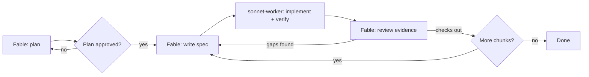

# Fable Advisor

**The smartest model runs the show. Sonnet does the typing.**

This is the architect pattern for Claude Code: your session runs on **Fable 5**, Anthropic's most capable model, doing all the planning, decomposition, and review. It never types implementation code itself — every implementation task gets delegated to a `sonnet-worker` subagent, and the architect reviews the worker's verification evidence before accepting the result or sending back a corrected spec.

## Install

```
claude plugin marketplace add justanotherkevin/fable-advisor
claude plugin install fable-advisor@fable-advisor
```

Updating an existing installation:

```
claude plugin marketplace update fable-advisor
claude plugin update fable-advisor@fable-advisor
```

## Use it

Start your session as the architect:

```
/model fable
```

Then just describe the task:

```
Research and build a Yelp-like food review app.
```

The loop:

1. **Plan.** Claude Code's native plan mode kicks in — Fable designs the approach, you approve it.
2. **Delegate.** The `orchestration` skill routes each piece of implementation to `sonnet-worker` with a concrete spec (objective, files, interfaces, constraints, verification command).
3. **Review.** The worker reports back with a diff and verification output. Fable reads the evidence — not just the worker's claim — before accepting.
4. **Continue.** Next chunk goes through the same loop, or the architect reports the whole task done once every piece checks out.



## Worked example

A spec Fable might hand to `sonnet-worker`:

```
OBJECTIVE: Add a GET /api/reviews/:id endpoint returning a single review.
FILES: src/routes/reviews.ts
INTERFACES: Review type already defined in src/types.ts — reuse it.
CONSTRAINTS: Follow the existing route pattern in src/routes/restaurants.ts.
             Don't touch the database schema.
VERIFICATION: npm test -- reviews.test.ts
```

The worker's report back:

```
WORKER REPORT
STATUS: complete
OBJECTIVE: Add GET /api/reviews/:id endpoint
CHANGES: src/routes/reviews.ts — added GET /:id handler, 404 on missing review
VERIFIED: npm test -- reviews.test.ts
  PASS reviews.test.ts (4 tests)
GAPS: none
```

Fable reads the actual test output before accepting, not just the `STATUS: complete` line.

## Requirements

- Claude Code with a subscription that includes Fable 5 access.
- **No Fable access?** Use `/model opus` for the session instead — same pattern, one tier down.

## License

MIT
